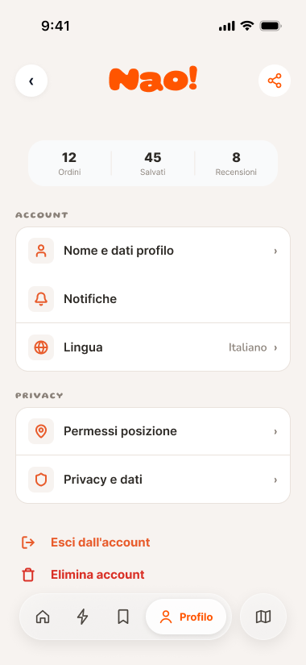
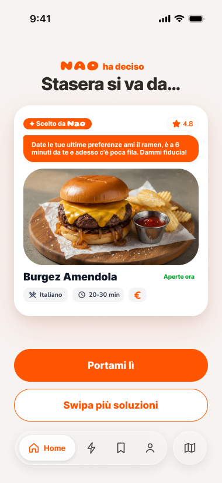
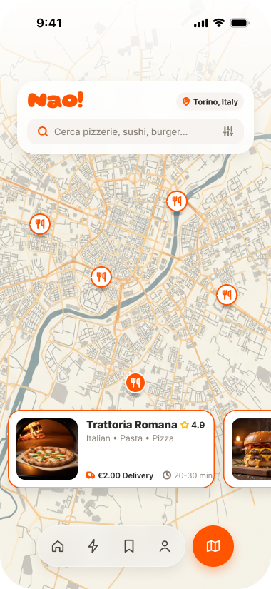
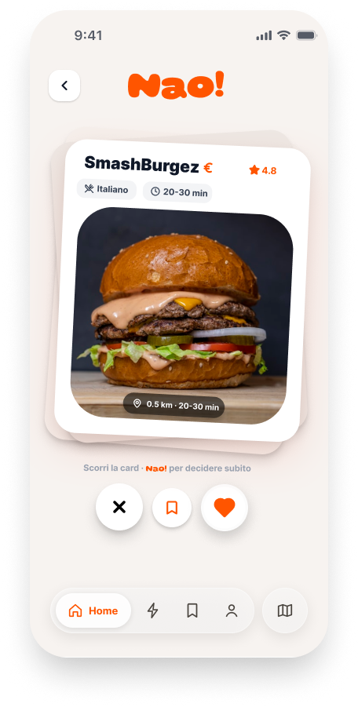

# 🚀 AI Automation Blueprints

Production-ready AI & n8n/Make automation blueprints for Fintech & High-Growth Scale-ups.

## 📌 Featured Blueprint: AI Executive Summarizer Agent

An automated n8n workflow designed to process incoming webhook events and leverage LLMs for instant executive reporting and insight extraction.

### 🛠 Architecture & Logic
1. **Webhook Ingestion:** Captures structured payload events from external systems (CRM, Form triggers, or API webhooks).
2. **AI Processing Layer (OpenAI API):** Evaluates payload context using `gpt-4o-mini` to derive 3 key actionable business takeaways.
3. **Automated Output:** Returns structured Markdown summary ready for downstream notifications or databases.

### 📂 Repository Structure
* `My workflow.json` — Importable n8n workflow definition file.

---
*Maintained as part of my AI Engineering & Operations Portfolio.*

---

## 🎨 Startup UI/UX Product Design & Figma Wireframes

Below are the core product interface mockups designed in Figma for the platform:

| Home Screen | User Profile | Verdict & AI Decision |
| :---: | :---: | :---: |
|  |  |  |

| Nearby Offers | Card Swipe Detail | Invite Friends |
| :---: | :---: | :---: |
|  |  |  |

