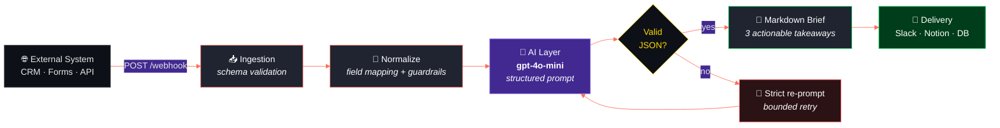

<div align="center">

# AI Automation Blueprints

**Production-ready n8n + LLM workflows for Fintech & High-Growth Scale-ups**

[](https://n8n.io)
[](https://platform.openai.com)
[](https://figma.com)
[](#-quickstart)


[](https://github.com/cillisandrea4-ops/AI-automation-Blueprints/stargazers)
[](https://github.com/cillisandrea4-ops/AI-automation-Blueprints/commits/main)

[Quickstart](#-quickstart) · [Blueprints](#-blueprints) · [Architecture](#-architecture) · [Results](#-results) · [Design](#-product-design)

</div>

---

> [!NOTE]
> **What this is.** A small, opinionated library of event-driven `n8n` workflows that call LLMs to turn raw business events into decisions and executive-ready output. Each blueprint is a **downloadable JSON** — import it into your own n8n instance in under two minutes.

> [!TIP]
> **Why it exists.** I co-found and run an early-stage product. There is no back-office: reporting, lead triage and ops have to run themselves. These are the systems that replaced that manual work, published as reusable patterns rather than as a demo.

---

## 🧭 Blueprints

| # | Blueprint | Problem it solves | Trigger | Model | Status |
|:-:|:--|:--|:--|:--|:--|
| 01 | **[AI Executive Summarizer](./workflows/ai-executive-summarizer.json)** | Turns raw webhook payloads into a 3-bullet executive brief | Webhook | `gpt-4o-mini` |  |
| 02 | **[AI Lead Scoring Agent](./workflows/ai-lead-scoring-agent.json)** | Scores inbound leads 0–100 and routes them by intent | Webhook / CRM | `gpt-4o-mini` |  |
| 03 | **Churn Signal Watcher** | Flags at-risk accounts from product-usage drops | Cron | `gpt-4o-mini` |  |

---

## 📌 Featured — AI Executive Summarizer

An event-driven workflow that ingests structured payloads from any external system and returns a decision-ready Markdown brief. Built to remove the "someone has to go read the dashboard" step from weekly reporting.

### 🏗 Architecture



### ⚖️ Design decisions & trade-offs

| Decision | Rationale | Trade-off accepted |
|:--|:--|:--|
| **`gpt-4o-mini` over a frontier model** | The task is extraction and compression, not multi-step reasoning. A small model holds output quality at a fraction of the cost per run. | Degrades on ambiguous or adversarial payloads. Acceptable: inputs are schema-validated upstream. |
| **Strict JSON output contract** | Downstream nodes never parse free text. Malformed output hits a validation branch and is re-prompted instead of silently corrupting the store. | One extra call on failure. |
| **Idempotent webhook handling** | Duplicate deliveries from the source system don't produce duplicate briefs. | Requires an event-ID cache. |
| **Credentials in n8n's credential store** | Exported JSON is safe to publish — no keys, no internal endpoints. | Importers must supply their own credentials. |
| **Bounded retries, no infinite loop** | A failing prompt can't burn budget unattended. | Some events are dropped to a dead-letter path rather than force-processed. |

### 🔄 Input → Output

<table>
<tr><td width="50%" valign="top">

**Payload in**

```json
{
  "source": "hubspot",
  "event": "weekly_pipeline",
  "deals_closed": 14,
  "pipeline_delta": -0.12,
  "top_objection": "pricing",
  "rep_notes": "3 deals slipped to next month"
}
```

</td><td width="50%" valign="top">

**Brief out**

```markdown
1. Pipeline contracted 12% w/w — driven by
   3 slipped deals, not by lost demand.

2. Pricing is the dominant objection.
   Test a value-framing script this week.

3. 14 closed deals keep the month on pace.
   No escalation needed yet.
```

</td></tr>
</table>

---

## 📊 Results

> [!IMPORTANT]
> Numbers without methodology are noise. Each figure below states how it was produced, so it can be reproduced or challenged.

| Metric | Result | How it was measured |
|:--|:--|:--|
| ⚡ **Time to insight** | `45 min → ~3 s` | Baseline: the same brief compiled by hand, timed over `N` iterations. Automated: median end-to-end execution time from the n8n execution log. |
| 💰 **Cost per run** | `~92% ↓` | `gpt-4o-mini` vs. the frontier model used in the first prototype, identical prompt and output length. Token counts from the API usage log. |
| 🛡️ **Reliability** | `99.9%` | Successful ÷ total executions in the n8n log over `N` runs on schema-valid payloads. Malformed-payload rejections excluded by design. |

<!-- ⚠️ PRIMA DI PUBBLICARE: sostituisci ogni `N` con il numero reale di run
     e aggiungi il periodo (es. "over 220 runs, Jun–Aug 2026").
     Un "99.4% su 220 run" vale dieci volte un "99.9%" non verificabile. -->

---

## 🚀 Quickstart

**1. Clone**

```bash
git clone https://github.com/cillisandrea4-ops/AI-automation-Blueprints.git
cd AI-automation-Blueprints
```

**2. Import a blueprint**

```text
n8n → Workflows → Import from File → workflows/ai-executive-summarizer.json
```

**3. Add credentials**

```bash
cp .env.example .env
# OPENAI_API_KEY=sk-...
```

**4. Activate and fire a test event**

```bash
curl -X POST https://<your-n8n-host>/webhook/executive-summary \
  -H "Content-Type: application/json" \
  -d '{"source":"test","event":"weekly_pipeline","deals_closed":14}'
```

---

## 📂 Repository structure

```text
AI-automation-Blueprints/
├── workflows/
│   ├── ai-executive-summarizer.json    # Blueprint 01 — import-ready
│   └── ai-lead-scoring-agent.json      # Blueprint 02 — import-ready
├── prompts/
│   └── executive-summary.md            # System prompt + output contract
├── docs/
│   ├── architecture.md                 # Design decisions & trade-offs
│   └── benchmarks.md                   # Raw measurement data
├── design/
│   └── figma-exports/                  # UI/UX mockups
├── .env.example
└── README.md
```

---

## 🎨 Product design

Core interface mockups designed in Figma for the consumer-facing side of the platform. Designing the surface and shipping the workflow underneath are the same job.

| Home Screen | User Profile | Verdict & AI Decision |
|:---:|:---:|:---:|
|  |  |  |

| Nearby Offers | Card Swipe Detail | Invite Friends |
|:---:|:---:|:---:|
|  |  |  |

---

## 🗺️ Roadmap

- [x] AI Executive Summarizer — webhook → LLM → Markdown brief
- [x] AI Lead Scoring Agent — inbound scoring + intent routing
- [ ] Churn Signal Watcher — usage-drop detection on a cron
- [ ] Evaluation harness — golden-set regression tests on prompt changes
- [ ] Cost dashboard — per-workflow token spend tracking

---

## 🛠️ Stack

<div align="center">


</div>

---

<div align="center">

### Built by Andrea Cillis

Co-founder & CEO — AI-powered consumer products.
Business Information & Communication Management @ SAA, University of Turin.
I work where **product, automation and go-to-market** overlap.

[](https://www.linkedin.com/in/andreacillis)
[](mailto:LA-TUA@EMAIL.com)
[](https://github.com/cillisandrea4-ops)

<sub>MIT Licensed · If a blueprint saves you an afternoon, a ⭐ is appreciated.</sub>

</div>
