<div align="center">

# AI Automation Blueprints

**Event-driven n8n + LLM workflows that turn raw business events into decisions.**


[](https://github.com/cillisandrea4-ops/AI-automation-Blueprints/stargazers)
[](https://github.com/cillisandrea4-ops/AI-automation-Blueprints/commits/main)

[Quickstart](#quickstart) · [Blueprints](#blueprints) · [Architecture](#architecture) · [Design decisions](#design-decisions) · [Results](#results) · [Documentation](#documentation)

</div>

---

> [!NOTE]
> **What this is.** A small, opinionated library of <code>n8n</code> workflows that call LLMs to compress business events into decision-ready output. Each blueprint is a downloadable JSON — import it into your own n8n instance in under two minutes.

> [!TIP]
> **Why it exists.** I co-found and run an early-stage product with no back-office. Reporting and lead triage had to run themselves. These are the systems that replaced that manual work, published as reusable patterns rather than as a demo.

---

## Blueprints

| Blueprint | Problem it solves | Trigger | Model | Status |
|:--|:--|:--|:--|:--|
| **[AI Executive Summarizer](ai-executive-summarizer.json⁠)** | Turns raw webhook payloads into a three-bullet executive brief | Webhook | <code>gpt&#8209;4o&#8209;mini</code> |  |
| **[AI Lead Scoring Agent](ai-lead-scoring-agent.json⁠)** | Scores inbound leads 0–100 and routes them by intent | Webhook / CRM | <code>gpt&#8209;4o&#8209;mini</code> |  |
| **Churn Signal Watcher** | Flags at-risk accounts from product-usage drops | Cron | <code>gpt&#8209;4o&#8209;mini</code> |  |

---

## Featured — AI Executive Summarizer

Ingests structured payloads from any external system and returns a decision-ready Markdown brief. Built to remove the "someone has to go read the dashboard" step from weekly reporting.

### Architecture

```mermaid
%%{init: {'theme':'base','themeVariables':{'primaryColor':'#1F2430','primaryTextColor':'#E6E6E6','primaryBorderColor':'#FF6D5A','lineColor':'#FF6D5A','secondaryColor':'#412991','tertiaryColor':'#0D1117','fontFamily':'ui-monospace, monospace'}}}%%
flowchart LR
    A["External system<br/>CRM · Forms · API"] -->|POST /webhook| B["Ingestion<br/><i>schema validation</i>"]
    B --> C["Normalize<br/><i>field mapping + guardrails</i>"]
    C --> D["AI layer<br/><b>gpt-4o-mini</b><br/><i>structured prompt</i>"]
    D --> E{"Valid<br/>JSON?"}
    E -->|yes| F["Markdown brief<br/><i>3 actionable takeaways</i>"]
    E -->|no| G["Strict re-prompt<br/><i>bounded retry</i>"]
    G --> D
    G -.->|retry budget spent| I["Dead-letter queue<br/><i>manual review</i>"]
    F --> H["Delivery<br/>Slack · Notion · DB"]

    style A fill:#0D1117,stroke:#30363D,color:#E6E6E6
    style B fill:#1F2430,stroke:#FF6D5A,color:#ffffff
    style C fill:#1F2430,stroke:#FF6D5A,color:#ffffff
    style D fill:#412991,stroke:#A78BFA,color:#ffffff
    style E fill:#0D1117,stroke:#FFD700,color:#FFD700
    style F fill:#1F2430,stroke:#00C853,color:#ffffff
    style G fill:#2A1215,stroke:#FF5252,color:#ffffff
    style H fill:#003D1A,stroke:#00C853,color:#ffffff
    style I fill:#2A1215,stroke:#FF5252,color:#E6E6E6
```



### Design decisions

Every choice below cost something. The trade-off column is the part worth reading.

| Decision | Rationale | Trade-off accepted |
|:--|:--|:--|
| <code>gpt&#8209;4o&#8209;mini</code> over a frontier model | The task is extraction and compression, not multi-step reasoning. A small model holds output quality at a fraction of the cost per run. | Degrades on ambiguous payloads. Acceptable: inputs are schema-validated upstream. |
| Strict JSON output contract | Downstream nodes never parse free text. Malformed output hits a validation branch instead of silently corrupting the store. | One extra call on failure. |
| Idempotent webhook handling | Duplicate deliveries from the source system don't produce duplicate briefs. | Requires an event-ID cache. |
| Credentials in n8n's credential store | Exported JSON is safe to publish — no keys, no internal endpoints. | Importers must supply their own credentials. |
| Bounded retries with a dead-letter path | A failing prompt can't burn budget unattended. | Some events are parked for manual review rather than force-processed. |

### Input and output

<table>
<tr><td width="50%" valign="top">

**Payload in**

```json
{
  "source": "hubspot",
  "event": "weekly_pipeline",
  "deals_closed": 14,
  "pipeline_delta": -0.12,
  "top_objection": "pricing",
  "rep_notes": "3 deals slipped to next month"
}
```

</td><td width="50%" valign="top">

**Brief out**

```markdown
1. Pipeline contracted 12% w/w — driven by
   3 slipped deals, not by lost demand.

2. Pricing is the dominant objection.
   Test a value-framing script this week.

3. 14 closed deals keep the month on pace.
   No escalation needed yet.
```

</td></tr>
</table>

---

## Design goals

This blueprint replaces a manual weekly reporting routine. What it is built to achieve, and how each claim can be checked once the workflow has run at volume:

| Goal | Why it matters | How it will be verified |
|:--|:--|:--|
| Cut time to insight | The manual version of this brief takes ~45 minutes of reading dashboards and writing. | Median end-to-end duration from the n8n execution log, against a stopwatch baseline of the manual process. |
| Keep cost per run low | A reporting job that runs weekly forever should not cost like a research task. | Token counts from the OpenAI usage dashboard, `gpt-4o-mini` against the frontier model used in the first prototype. |
| Fail loudly, never silently | A brief that quietly drops the worst number is more dangerous than no brief. | A dedicated error flow alerts by email on any failed run. Success rate from the n8n execution log. |

> [!NOTE]
> Measured results will be published in [`docs/benchmarks.md`](./docs/benchmarks.md) once the workflow has run at volume. No performance figures are claimed here until then.
---

## Quickstart

**Prerequisites** — an n8n instance (self-hosted or cloud) and an OpenAI API key.

**1. Clone the repository**

```bash
git clone https://github.com/cillisandrea4-ops/AI-automation-Blueprints.git
cd AI-automation-Blueprints
```

**2. Import a blueprint**

```text
n8n → Workflows → Import from File → workflows/ai-executive-summarizer.json
```

**3. Configure credentials**

```bash
cp .env.example .env
```

Then fill in your values:

```bash
OPENAI_API_KEY=sk-your-key-here
N8N_WEBHOOK_PATH=executive-summary
```

> [!WARNING]
> Keys belong in n8n's credential store, never inside a committed workflow file. `.env` is gitignored — keep it that way.

**4. Activate the workflow and fire a test event**

```bash
curl -X POST https://<your-n8n-host>/webhook/executive-summary \
  -H "Content-Type: application/json" \
  -d '{"source":"test","event":"weekly_pipeline","deals_closed":14}'
```

A well-formed request returns a three-bullet Markdown brief. Anything that fails schema validation is rejected before it reaches the model.

---

## Repository structure

```text
AI-automation-Blueprints/
├── workflows/
│   ├── ai-executive-summarizer.json    # Blueprint 01 — import-ready
│   └── ai-lead-scoring-agent.json      # Blueprint 02 — import-ready
├── prompts/
│   └── executive-summary.md            # System prompt + output contract
├── docs/
│   ├── architecture.md                 # Design decisions & trade-offs
│   └── benchmarks.md                   # Raw measurement data
├── .env.example
├── LICENSE
└── README.md
```

## Documentation

| File | What's inside |
|:--|:--|
| [`docs/architecture.md`](docs/architecture.md) | Node-by-node walkthrough, error handling, retry and dead-letter logic |
| [`docs/benchmarks.md`](docs/benchmarks.md) | Raw timing and token-cost data behind the Results table |
| [`prompts/executive-summary.md`](docs/executive-summary.md) | System prompt and the JSON output contract enforced downstream |
| [`workflows/`](workflows) | Import-ready blueprint JSON files |
| [`.env.example`](docs/.env.example) | Required environment variables |

---

## Roadmap

- [x] AI Executive Summarizer — webhook → LLM → Markdown brief
- [x] AI Lead Scoring Agent — inbound scoring + intent routing
- [ ] Churn Signal Watcher — usage-drop detection on a cron
- [ ] Evaluation harness — golden-set regression tests on prompt changes
- [ ] Cost dashboard — per-workflow token spend tracking

---


## Stack


---

## Contributing

Issues and pull requests are welcome — particularly new blueprints, prompt improvements, and benchmark data from other n8n setups. Open an issue before large changes so we can agree on scope first.

## License

MIT — see [`LICENSE`](./LICENSE). Use these blueprints commercially, no attribution required.

---

<div align="center">

### Andrea Cillis

Co-founder & CEO — AI-powered consumer products.
BSc Business Information & Communication Management, SAA — University of Turin.
I work where product, automation and go-to-market overlap.

[](https://www.linkedin.com/in/andreacillis)
[](mailto:cillisandrea4@gmail.com)
[](https://github.com/cillisandrea4-ops)

<sub>If a blueprint saves you an afternoon, a star is appreciated.</sub>

</div>
